<div align="center">

# Lumio

**Turn kWh into soles in seconds. A transparent electricity-bill calculator for Peru.**

[Live demo](https://lisk0vian.github.io/lumio/) · [English](https://lisk0vian.github.io/lumio/en/) · [How the math works](https://lisk0vian.github.io/lumio/en/calculation)

[](https://github.com/lisk0vian/lumio/actions/workflows/ci.yml)
[](https://astro.build)
[](https://react.dev)
[](https://www.typescriptlang.org)
[](https://tailwindcss.com)
[](https://ui.shadcn.com)
[](https://base-ui.com)
[](https://zustand.docs.pmnd.rs)
[](https://animejs.com)
[](https://github.com/zumerlab/snapdom)
[](https://vitest.dev)
[](https://lisk0vian.github.io/lumio/)

<a href="docs/demo-en.mp4"></a>

<sub>Click the animation to open the full-quality MP4.</sub>

</div>

---

## Purpose

In Peru the electricity bill (*recibo de luz*) folds energy use, a fixed charge, public lighting and 18% IGV into one number. That makes everyday questions hard to answer:

- *"If I use 120 kWh this month, how much will I pay?"*
- *"I have S/ 100 budgeted. How many kWh is that?"*
- *"Is my usage normal, or should I cut back?"*

Lumio answers all three instantly, from the same four figures printed on any bill. Everything runs in the browser, with no account, no backend and no tracking.

**Who it's for:** households checking their bill, people splitting it with roommates or family, and anyone budgeting their monthly spend.

---

## The product

### Convert in both directions

Type kWh to get soles, or type soles to get kWh. The reverse direction is the exact inverse of the same formula, so converting back and forth always returns the original value.

| kWh → S/ | S/ → kWh |
|---|---|
| 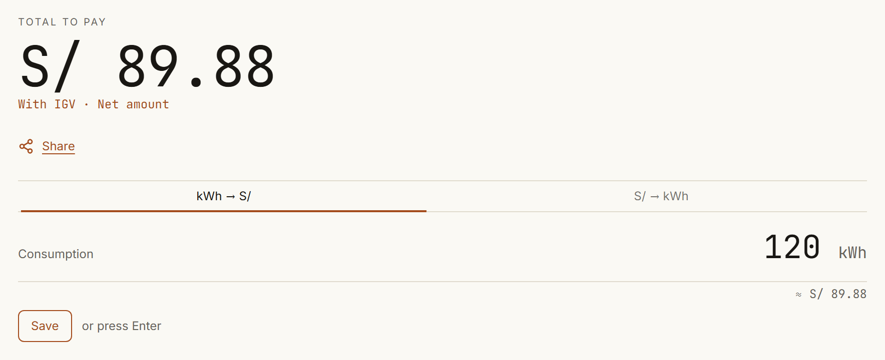 | 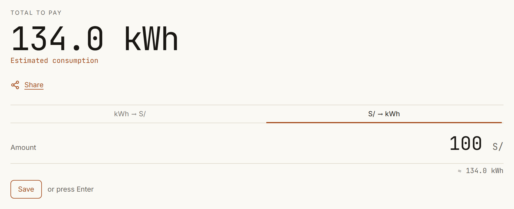 |

### Every sol, itemized

The breakdown updates as you type. The level scale tells you where your usage falls, with text labels as well as color.

| Bill breakdown | Consumption level |
|---|---|
| 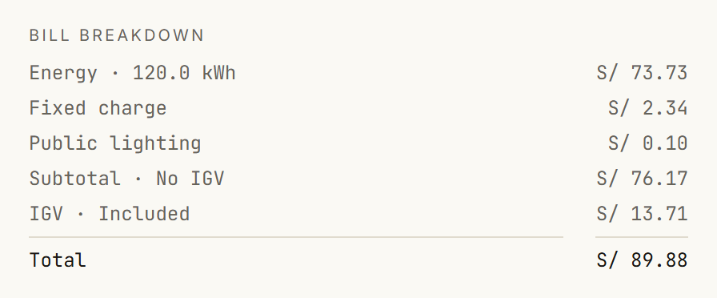 | 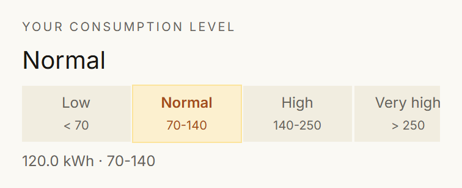 |

### Track your spending

Press Enter to save a calculation. Lumio keeps your history on the device and summarizes it.

<p align="center">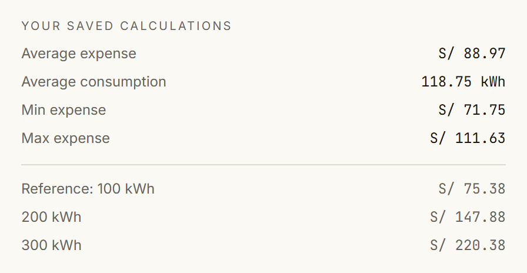</p>

### Share the receipt

This is the actual PNG Lumio exports, rendered from the DOM with snapdom. It can be copied, downloaded, sent through the native share sheet, or posted to WhatsApp as formatted text.

<p align="center">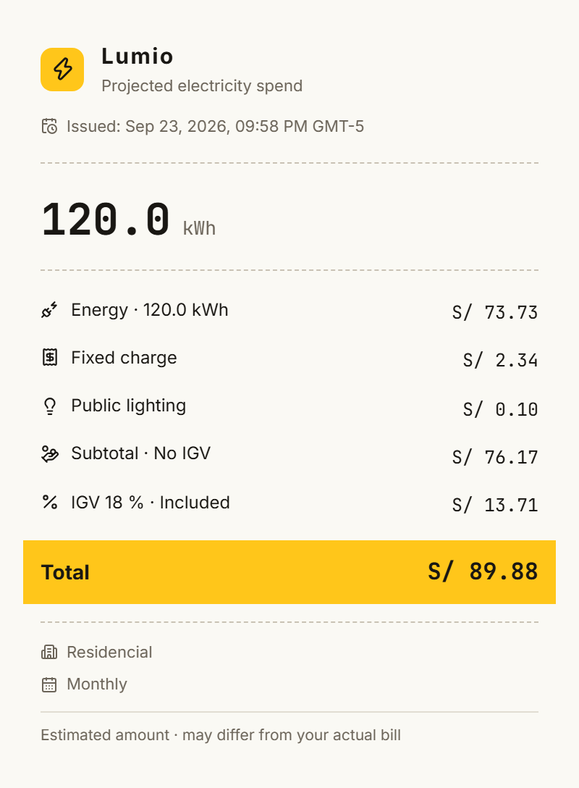</p>

### Your tariff, your rules

Choose the regulator and tariff, edit the price per kWh, switch each charge on or off, and pick monthly or bimonthly billing.

<p align="center"></p>

### Mobile first

Under 1024 px the layout becomes three tabs. The desktop-only parts of the app are never downloaded on a phone.

| Calculate | History | Settings |
|---|---|---|
| 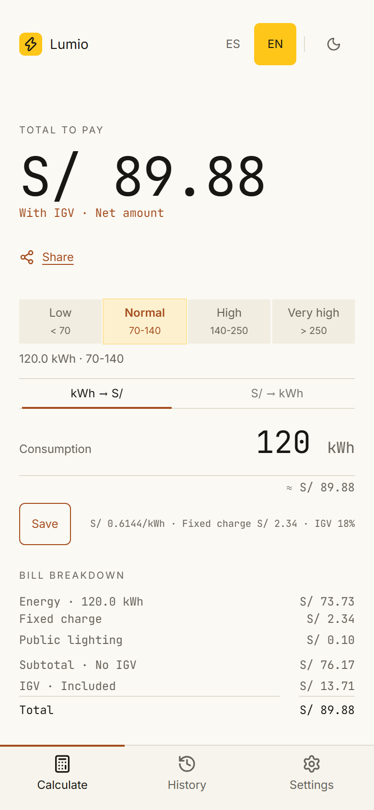 | 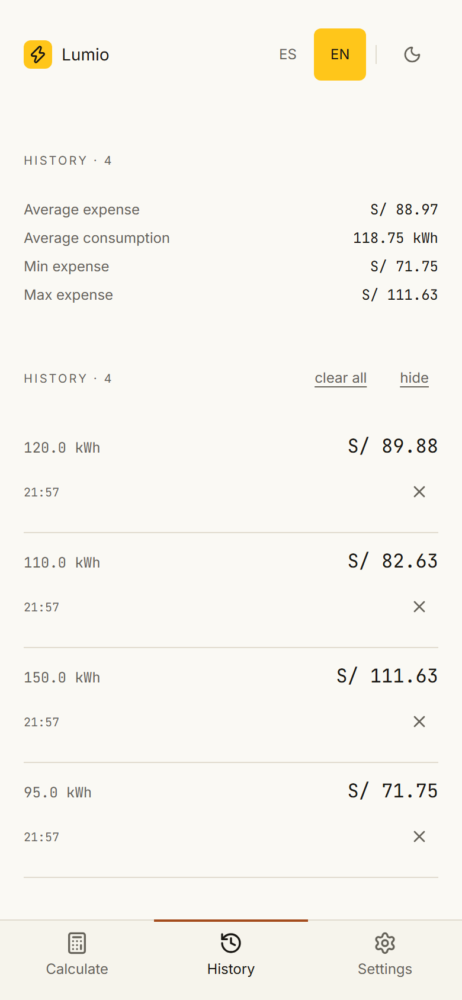 | 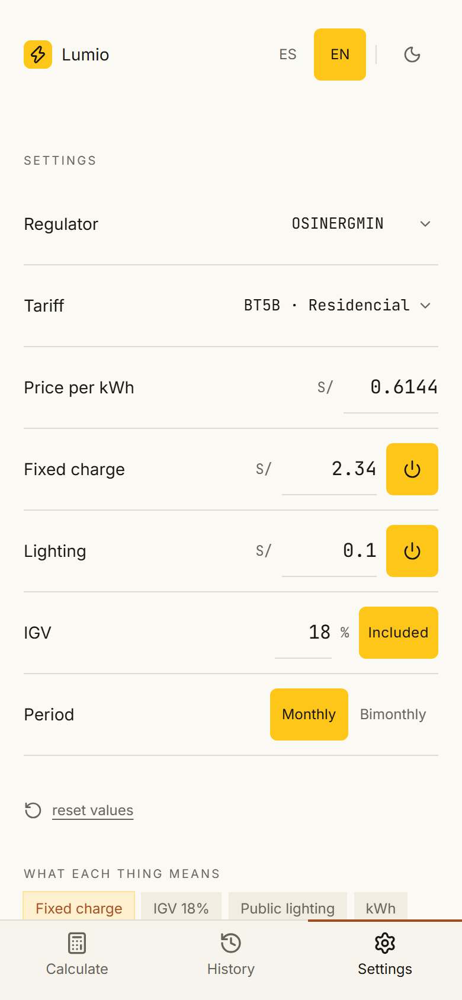 |

### Dark mode

Follows the system preference on first visit, and the toggle in the header remembers your choice.

<p align="center">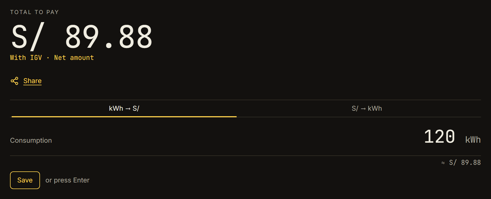</p>

---

## How the calculation works

```
subtotal = kWh × price per kWh + fixed charge + public lighting
total    = (subtotal + subtotal × 18% IGV) × period      period: 1 monthly, 2 bimonthly
```

| 120 kWh on residential BT5B | Amount |
|---|---:|
| Energy · 120 kWh × S/ 0.6144 | S/ 73.73 |
| Fixed charge | S/ 2.34 |
| Public lighting | S/ 0.10 |
| **Subtotal** | **S/ 76.17** |
| IGV · 18% | S/ 13.71 |
| **Total** | **S/ 89.88** |

> [!NOTE]
> The BT5B residential tariff was verified against a real June 2026 Lima Norte bill. The other categories in [`src/data/tariffs.data.ts`](src/data/tariffs.data.ts) are estimates that users can edit in the settings bar.

---

## Architecture

Lumio is a static site. Astro renders the pages to HTML at build time, and React runs only inside the interactive islands. The islands share one store, and all the math lives in pure, tested functions.

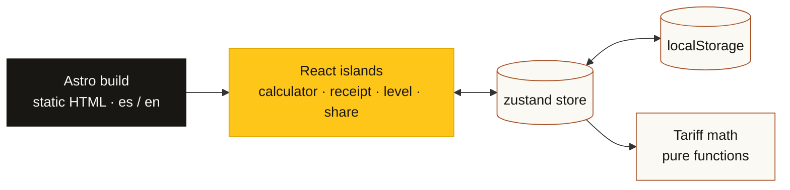

| Decision | Why |
|---|---|
| Static output instead of an SPA | The page is mostly content. Prerendered HTML loads fast and is free to host on GitHub Pages. |
| React only in islands, loaded on demand | Desktop-only islands are never downloaded on mobile, and content below the fold hydrates when it becomes visible. |
| One store with versioned migrations | Islands stay in sync without prop drilling, and saved history survives schema changes. |
| Language in the URL | `/` and `/en/` are real, shareable, crawlable pages. |
| Pure, memoized math | Easy to unit-test, and computed once per change instead of once per island. |

---

## Getting started

Requires Node.js 22.12 or later and pnpm.

```bash
git clone https://github.com/lisk0vian/lumio.git
cd lumio
pnpm install
pnpm dev          # http://localhost:4321/lumio/
```

| Script | Purpose |
|---|---|
| `pnpm dev` | Dev server |
| `pnpm build` | Production build to `dist/` |
| `pnpm preview` | Serve the production build |
| `pnpm test` | Unit tests |
| `pnpm typecheck` | `astro check` |
| `pnpm format` | Prettier |

## Author

Built by [@lisk0vian](https://github.com/lisk0vian). Feedback is welcome, so feel free to [open an issue](https://github.com/lisk0vian/lumio/issues).
